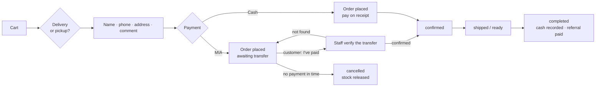
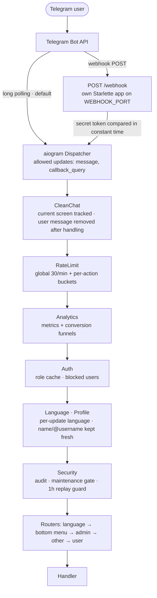
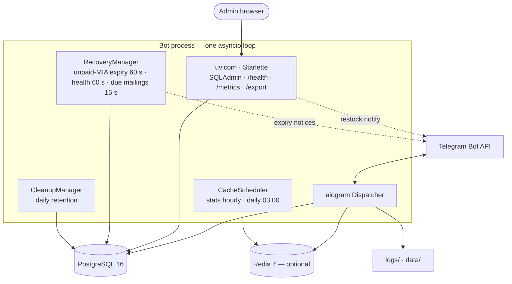
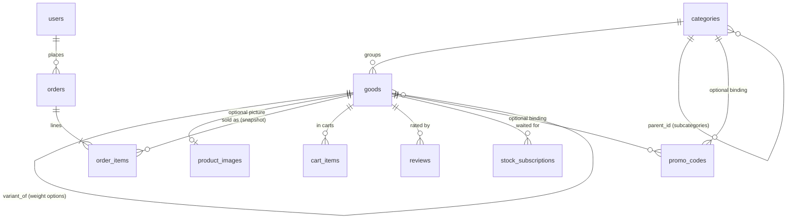
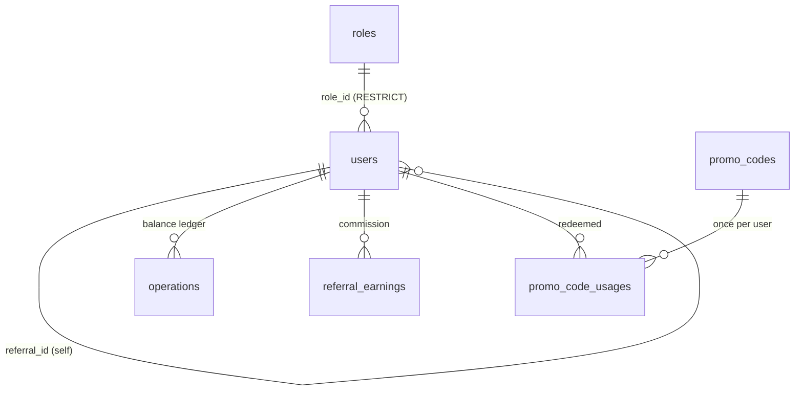

# 📦 Telegram Shop Bot — Physical Goods

A Telegram bot for selling **physical goods**: catalog with real stock, cart, delivery or
pickup, and exactly **two payment methods** — **MIA** instant transfer and **cash on
delivery / pickup**. Orders are tracked from *new* to *completed* by your staff, in chat or
in a web panel. Role-based admin, store balance + referrals, optional Redis caching.

[](https://www.python.org/downloads/)
[](https://docs.aiogram.dev/)
[](https://www.postgresql.org/)
[](https://www.docker.com/)
[](LICENSE)

> Derived from [interlumpen/Telegram-shop](https://github.com/interlumpen/Telegram-shop), a
> digital-goods shop. Digital delivery (accounts/keys), Telegram Stars, CryptoPay, Telegram
> Payments and balance top-ups were removed; orders, stock reservation, delivery/pickup and
> the MIA / cash-on-delivery payments were added.

## 📋 Table of Contents

- [Features](#-features)
- [How an order works](#-how-an-order-works)
- [Security](#-security)
- [Tech Stack](#-tech-stack)
- [Architecture](#-architecture)
- [Configuration](#-configuration)
- [Installation](#-installation)
- [Admin panel](#-admin-panel)
- [Upgrading from the digital-goods shop](#-upgrading-from-the-digital-goods-shop)
- [Testing](#-testing)
- [Development workflow](#-development-workflow)
- [Project documentation](#-project-documentation)

---

## ✨ Features

- **Catalog & stock** — categories and products, each with an integer **units in stock**. Stock is *reserved* the
  moment an order is placed and *released* if the order is cancelled, so two customers can never buy the last
  unit. Optional time-limited per-product sales.
- **Subcategories** — a top-level category can hold subcategories (two levels max, e.g. *Hookah tobacco → Classic /
  Intense*). A category holds either subcategories or products, never both. Top-level categories appear as buttons on
  the main menu; promo codes bound to a parent also cover its subcategories.
- **Weight options** — a product can have options such as *50 g / 200 g*, each with its own price, stock and sale and
  sharing the product's picture and description. The product card shows a selector; lists and search show only the main
  product; reviews are shared; the cart and orders show `NAME · 200 g` in the customer's language. Admins add options
  with *➕ Add option* in the bot, or inside the product in the web panel (*Options* rows: press **＋** to add a row with
  option name, price and stock; remove a row to delete the option).
- **Bottom menu & clean chat** — a permanent keyboard (🛍 Catalog · 🛒 Cart · 👤 Profile) sits under the chat. It is
  carried by a short welcome line ("Welcome to UMBRA" / "Bun venit la UMBRA" / «Добро пожаловать в UMBRA») that always
  stays above the menu. The chat shows only the current screen: each screen replaces the previous one, the user's own
  messages are removed once handled, and `/start` sweeps the last ~100 messages. Messages sent to staff stay.
  `CLEAN_CHAT=0` keeps the full history.
- **Product pictures** — each product can have one picture, shown on its card in the shop and kept exactly
  as uploaded (JPEG, PNG or WEBP, up to 10 MB). Admins add it in the bot (an optional photo step when
  creating a product, or **Change photo / Remove photo** on the product's stock screen) or in the web panel
  (an upload field on the product form). Send the picture as a *file* to keep the original quality.
- **Translated catalog** — category names, product names and product descriptions can each be entered in
  English, Russian and Romanian, and every customer sees them in their own language. The shop's **main
  language** (`BOT_LOCALE`) is the fallback: a missing translation shows the main-language text, so nothing
  is ever blank. Admins always work in their own interface language first: the bot's add-category /
  add-product wizards ask in your language, then the other two with a **Skip** button, and in the web panel
  the field for *your* language is simply called **Name** / **Description** (an English-interface admin sees
  `Name`, `Name (Russian)`, `Name (Romanian)`). **🌐 Translations** (on the product's stock screen and in the
  Categories menu) edits or clears them later, and any admin command that asks for a name accepts it in any
  language. Search finds a product by a word in any language.
- **Search** — find a product by name or description; results are paginated and open the
  normal product page. Backed by trigram (GIN) indexes on PostgreSQL, with a graceful fallback
  when `pg_trgm` isn't available.
- **Cart & promo codes** — several products with quantities, **Apply promo code** inside the cart (between *Checkout* and
  *Clear cart*; the code goes on every line it fits and is spent on the best one), one atomic
  checkout. Promo types: `percent`, `fixed`, `balance`; usage limits, expiry, category/product
  binding. A promo stacks on top of an active sale.
- **Delivery or pickup** — the customer chooses; delivery collects name, phone, address and an
  optional comment, pickup shows your pickup address. Either can be switched off.
- **Two payment methods**
  - **MIA** — the bot shows where to send the transfer (recipient / phone / IBAN), the exact
    amount and an order reference. The customer taps **I've paid** (optionally attaching a
    screenshot); staff verify the money arrived and confirm — or reject — in one tap. Unpaid
    MIA orders are cancelled automatically after `MIA_PAY_TIMEOUT_MIN` and their stock is released; the customer is reminded once
    `MIA_REMIND_BEFORE_MIN` minutes before that, and staff are alerted once about a claimed-but-unchecked transfer
    (`STALE_PAYMENT_ALERT_MIN`) or an untouched cash order (`STALE_ORDER_ALERT_MIN`).
  - **Cash on delivery / pickup** — nothing to do up front; the cash is recorded as collected
    when staff mark the order completed.
- **Order tracking** — `new → confirmed → shipped → completed` (or `cancelled`). Customers get
  a message at every step and can open **My orders** at any time; staff get an alert for every
  new order and every "I've paid" claim.
- **Backups** — `scripts/backup_db.sh` / `scripts/restore_db.sh` make and restore verified, rotated database dumps ([guide](docs/BACKUP_AND_RESTORE.md));
  an Admin can erase a client's personal data from the client's page.
- **Command menu** — the ☰ button next to the input field lists `/start`, `/catalog`, `/cart`, `/orders`, `/favorites`, `/profile`, `/language`
  in the customer's language; each opens the same screen as the matching button.
- **Favorites** — every product card has a ⭐ button; the profile's **Favorites** list (paged) opens the cards. A weight
  option stars its main product. (The card no longer has *Order now* or a promo button: add to cart, apply the promo there.)
- **Store balance & referrals** — admins can credit a customer's balance, balance promo codes
  credit it too, and a referrer earns `REFERRAL_PERCENT`% of every referred customer's
  **completed** order. Customers can spend their balance at checkout.
- **Restock notifications** — a sold-out product offers "notify me"; when stock arrives
  (from the bot, the web panel, or a cancelled order) everyone waiting is messaged once.
- **Reviews** — 1–5★ with optional text, once per user per product, only after receiving it.
- **Roles (RBAC)** — 11 granular permission bits, built-in `USER`/`ADMIN`/`OWNER` plus custom
  roles. You can never grant a permission you don't hold yourself.
- **Admin** — an in-chat menu **and** a web panel (SQLAdmin): orders, catalog and stock, users
  and balances, promo codes, broadcast, statistics, CSV export, and a full audit log.
- **Performance** — fully async DB (`asyncpg` + async SQLAlchemy); hot paths stay off both the
  database and the network (rate-limit decisions in one Redis call, role/blocked checks from
  process memory, batched audit rows, cached paginator counts, single-flighted cache misses,
  invalidation by name — never by scanning the keyspace). **Optional** Redis caching and
  persistent FSM storage; the bot runs without Redis too.
- **Localization** — English, Russian and Romanian in **both** the bot and the web panel. Every Telegram
  user is asked for their language at `/start` and it is remembered (🌐 Language in the profile changes it);
  messages to someone else — staff order alerts, status updates to customers, restock notices — are
  sent in *their* language. `BOT_LOCALE` is only the default for people who haven't chosen yet.
- **Web accounts** — several logins for the panel with two levels: **Admin** (everything, plus creating,
  disabling and editing accounts) and **Staff** (everything else). Passwords are stored hashed; the login
  page asks for the language and remembers it per account.

## 🧾 How an order works



Rules enforced in the database transaction, not in the UI:

- Placing an order **reserves stock** and clears the cart in one transaction. If any line is
  short, the whole order is refused and nothing changes.
- The total the customer confirmed is re-checked; if a price or sale changed meanwhile the
  order is refused (`price_changed`) instead of charging a different amount.
- An MIA order can't be confirmed, shipped or completed until staff verify the payment.
- **Cancelling** (staff, the customer while the order is still new and unpaid, or the MIA
  timeout) puts the stock back and returns any balance that was spent. If money was already
  collected the order is flagged *refund due* — the bot never moves cash itself.
- Completing an order pays the referral commission exactly once, on the cash actually paid
  (balance spent on the order earns no commission).

---

## 🔒 Security

Implemented, and described honestly so you know what to rely on:

- **Orders & money** — stock reservation and release run under row locks (ACID); goods are
  locked in a deterministic order so concurrent carts can't deadlock; a transition table plus
  per-state checks stop an order from skipping steps; balance changes are row-locked; the
  referral commission can only be paid on the single transition into *completed*;
  self-referral is blocked by DB `CHECK` constraints and a transaction guard. **Overselling is
  prevented at the database layer**, not by trusting the client. **MIA payments are verified by
  a human** — the bot never treats "I've paid" as proof of payment.
- **Access control** — Telegram-ID authentication; an 11-bit permission bitmask with bitwise
  *subset* validation (you cannot create or assign a role exceeding your own). Order
  management has its own permission. A permission bitmask lives in exactly one cache — an
  in-process tier backed by Redis (when enabled) — so every role change, block, or web-panel
  edit clears both tiers immediately.
- **Rate limiting** — global and per-action limits with temporary bans. With Redis the whole
  decision is one atomic script; without Redis it degrades to a per-process limiter with the
  same verdicts. Admins bypass the windows but are still subject to a ban. The web-panel login
  limiter (5 attempts / 15 min per IP) and 30-minute sessions remain per-process.
- **Web panel** — constant-time credential/secret comparison; proxy-aware client IP (trusts
  `X-Forwarded-For` only when the socket peer is loopback); remote login with the default
  `admin`/`admin` is blocked; every create/edit/delete is audit-logged; order and money
  tables are read-only so order rules can't be bypassed.
- **Input handling** — all database access is parameterized via the SQLAlchemy ORM; customer
  text (name, address, comment) is length-limited and HTML-escaped when shown to staff;
  broadcast/category text is sanitized; search `LIKE` wildcards are escaped; CSV export
  neutralizes spreadsheet formula injection; item names are control-character filtered.
- **Stale-action guard** — taps on a transactional message older than 1 hour are rejected.

## 💻 Tech Stack

Python 3.11+ · aiogram 3 · PostgreSQL 16 (async SQLAlchemy 2.0 + `asyncpg`) · Alembic ·
Redis 7 *(optional)* · SQLAdmin + Starlette (web panel) · Pydantic · Docker.

## 🏗️ Architecture

<details>
<summary><b>System architecture</b> (click to expand)</summary>

Everything runs in **one process on one asyncio event loop**: the bot, the web panel, and the
background workers. There is no broker and no worker pool — the "services" are long-lived tasks.

**How an update becomes a handler call**



The middleware order is the order they are registered in [`bot/main.py`](bot/main.py) —
aiogram runs the first-registered outermost. The clean-chat layer wraps everything (it tidies up after the handler
returns); rate limiting still rejects a flood before any handler runs. Bot requests also pass a session middleware
(`CleanChatRequestMiddleware`) that deletes the previous screen when a new message is sent to the chat being served.

**What runs, and what it talks to**



Worth knowing:

- **No payment gateway.** MIA is a manual transfer verified by staff and cash is collected on
  delivery, so there are no payment webhooks, API keys or provider outages to depend on.
- **Webhook mode runs its own listener.** `WEBHOOK_ENABLED=1` starts a second, minimal Starlette
  app on `WEBHOOK_HOST:WEBHOOK_PORT` serving nothing but `POST {WEBHOOK_PATH}`; the secret header
  is compared with `hmac.compare_digest`. It is deliberately *not* mounted on the admin app.
- **Redis is optional.** Without it: in-memory FSM, no caching, per-process rate limiter and
  role cache. With it, that state is shared and survives a restart. A configured-but-unreachable
  Redis degrades to in-memory storage at startup instead of breaking every update.
- **The web panel runs in the bot's process**, so an edit there clears the same caches and can
  message users — that is how a restock added in the panel reaches the people waiting for it.
- **Shutdown is graceful**: tasks stopped, metrics snapshot written to `data/final_metrics.json`,
  webhook removed, buffered audit rows flushed, DB engine closed.

</details>

<details>
<summary><b>Database schema</b> (click to expand)</summary>

Exact columns, indexes and `CHECK` constraints live in
[`bot/database/models/main.py`](bot/database/models/main.py).

**Catalog, orders & stock**



**Users, money & access**



`audit_log` is absent on purpose: its `user_id` carries **no** foreign key, so the trail outlives
the user it refers to.

</details>

The data model, in plain terms:

- **users** — one row per Telegram user: store balance, role, and (optionally) who referred them.
- **roles** — a name plus a permission **bitmask** (see the table under *Admin panel*).
- **categories → goods** — a product belongs to a category and carries `stock`, the units on
  hand (`CHECK (stock >= 0)`). `categories.parent_id` makes a subcategory (two levels, enforced in code);
  `goods.variant_of` / `variant_label` make a **weight option** — its own row with its own price and stock, named
  `"<product> · <label>"`, in its product's category.
- **orders** / **order_items** — an order stores its status, payment method and status,
  fulfilment, contact details, total, the part paid from balance, the MIA screenshot, and the
  MIA pay-by deadline. Each line keeps the product **name and price as a snapshot** (the
  product link is `ON DELETE SET NULL`), so history survives a product being renamed or removed.
- **Translations** — `categories` and `goods` carry optional `name_en/ru/ro` (and `goods.description_en/ru/ro`);
  `order_items` snapshots the translated names at order time. The canonical `name` / `description` stay the
  unique lookup keys.
- **product_images** — a product's optional picture (the uploaded bytes, plus Telegram's cached
  `file_id`), kept apart from `goods` so the bytes never ride along in item lookups or the Redis cache.
- **cart_items** / **reviews** — reference their product by foreign key; a cart holds one row
  per product with a `quantity` (`CHECK (quantity > 0)`).
- **stock_subscriptions** — who is waiting for a sold-out product; rows are *consumed* when the
  notification is sent, which stops a restock from messaging twice.
- **operations** — the balance ledger (admin credits and deductions, balance promos).
- **promo_codes** (+ per-user usages) — bound to a category or a product; carries its own `scope`
  because bindings are `ON DELETE SET NULL`, so a promo whose target is gone applies to nothing.
- **users** also carry the customer profile: `username`, `first_name`, `last_name` (from Telegram), `phone`, `address`
  (from the latest order), staff `notes`, `last_seen_at`.
- **shipping_methods** — delivery methods (translated name, price, optional free-from amount, active, position); an order keeps
  `shipping_name` and `delivery_fee` (the fee is part of `total`).
- **mailings** — web-panel mass messages: text (Telegram HTML), picture bytes + cached `file_id`, audience, status, schedule,
  counters (total / sent / blocked / failed). **web_users** — panel accounts (`telegram_id` is where test mailings go).
- **referral_earnings**, and an **audit_log** of every admin action. All money is stored as exact
  `NUMERIC(12,2)` — never floats.

---

## ⚙️ Configuration

Copy `.env.example` to `.env` and fill it in. `TOKEN`, `OWNER_ID` and the `POSTGRES_*` values
are **required**; everything else has a sensible default.

<details open>
<summary><b>Telegram, orders &amp; payments</b></summary>

| Variable                    | Description                                                                | Default        |
|-----------------------------|----------------------------------------------------------------------------|----------------|
| `TOKEN`                     | Bot token from [@BotFather](https://telegram.me/BotFather)                 | **required**   |
| `OWNER_ID`                  | Your [Telegram ID](https://telegram.me/myidbot) — becomes the first OWNER  | **required**   |
| `PAY_CURRENCY`              | Currency shown in prices (MDL, EUR, RON…)                                  | `MDL`          |
| `MIA_RECIPIENT`             | Name of the MIA account holder shown to customers                          | –              |
| `MIA_PHONE`                 | Phone number linked to your MIA account                                    | –              |
| `MIA_IBAN`                  | IBAN shown as an alternative way to pay                                    | –              |
| `MIA_PAY_TIMEOUT_MIN`       | Minutes to pay an MIA order before it is cancelled and stock released      | `120`          |
| `MIA_REMIND_BEFORE_MIN`     | Remind the customer once this many minutes before the MIA deadline (0 = off) | `30`        |
| `STALE_PAYMENT_ALERT_MIN`   | Alert staff once about an unchecked "I've paid" claim after N minutes (0 = off) | `30`     |
| `STALE_ORDER_ALERT_MIN`     | Alert staff once about an untouched new cash order after N minutes (0 = off) | `60`       |
| `COD_ENABLED`               | Offer cash on delivery / pickup (`1`/`0`)                                  | `1`            |
| `DELIVERY_ENABLED`          | Offer delivery (`1`/`0`)                                                   | `1`            |
| `PICKUP_ENABLED`            | Offer pickup (`1`/`0`)                                                     | `1`            |
| `PICKUP_ADDRESS`            | Shown to customers who choose pickup                                       | –              |
| `DELIVERY_INFO`             | Note shown to customers who choose delivery (areas, cost, timing)          | –              |
| `ORDERS_CHAT_ID`            | Extra chat/group that also receives new-order alerts                       | –              |
| `ERROR_ALERTS`              | Message the owner when the bot logs an error (`0` = off)                    | `1`         |
| `ERROR_ALERT_CHAT_ID`       | Extra chat/group that also receives error alerts                           | –           |
| `SHOP_TIMEZONE`             | Timezone (IANA name) for mailing times typed in the web panel              | `Europe/Chisinau` |
| `REFERRAL_PERCENT`          | Referral commission % on completed orders (0–99, `0` disables)             | `0`            |
| `MIN_AMOUNT` / `MAX_AMOUNT` | Allowed range for an admin's manual balance top-up / deduction             | `1` / `100000` |

**MIA is offered only when at least one of `MIA_RECIPIENT`, `MIA_PHONE`, `MIA_IBAN` is set.**
Staff with the order-management permission always get order alerts in private chat; set
`ORDERS_CHAT_ID` to copy them to a staff group (add the bot to it first).

</details>

<details>
<summary><b>Links, locale &amp; logging</b></summary>

| Variable                                  | Description                                                   | Default                           |
|-------------------------------------------|---------------------------------------------------------------|-----------------------------------|
| `CHANNEL_URL` / `CHANNEL_ID`              | Optional news channel (new-product posts, subscription check) | –                                 |
| `HELPER_ID`                               | Support user Telegram ID                                      | –                                 |
| `RULES`                                   | Rules text shown in the bot                                   | –                                 |
| `BOT_LOCALE`                              | Default language (`en`, `ru`, `ro`) for people who haven't chosen one | `ru`                          |
| `BOT_LOGFILE` / `BOT_AUDITFILE`           | Log file paths                                                | `logs/bot.log` / `logs/audit.log` |
| `LOG_TO_STDOUT` / `LOG_TO_FILE` / `DEBUG` | `1`/`0` toggles                                               | `1` / `1` / `0`                   |
| `REVIEWS_ENABLED`                         | Enable product reviews (`1`/`0`)                              | `1`                               |
| `CLEAN_CHAT`                              | Keep the chat down to the current screen (`1`/`0`)            | `1`                               |

</details>

<details>
<summary><b>Web admin panel</b></summary>

| Variable                            | Description                                                    | Default                   |
|-------------------------------------|----------------------------------------------------------------|---------------------------|
| `ADMIN_HOST` / `ADMIN_PORT`         | Bind address / port                                            | `localhost` / `9090`      |
| `ADMIN_USERNAME` / `ADMIN_PASSWORD` | First Admin account, **created only when no web account exists yet**; after that accounts are managed in the panel | `admin` / `admin` |
| `SECRET_KEY`                        | Session signing key                                            | `change-me-in-production` |
| `ADMIN_COOKIE_SECURE`               | Mark session cookie `Secure`; `auto` = on unless loopback-only | `auto` (or `1` / `0`)     |

`SECRET_KEY` signs the admin session cookie, so leaving it at the shipped default means anyone
who can reach the panel can forge a logged-in session and export every customer and order.
**The bot refuses to start** with a default `SECRET_KEY` or `ADMIN_PASSWORD` when the panel is
reachable — that is, when `ADMIN_HOST` is not loopback or `WEBHOOK_ENABLED=1`. On a
loopback-only bind it is a warning instead, so local development still works.

In Docker the panel is published on `127.0.0.1:9090` only. `ADMIN_COOKIE_SECURE` (`auto` by
default) marks the session cookie `Secure` whenever the panel is not loopback-only; set it to
`0` if you deliberately terminate TLS elsewhere and need plain HTTP on the hop.
</details>

<details>
<summary><b>Database, Redis, webhook, cleanup</b></summary>

| Variable                                                              | Description                                                       | Default                                  |
|-----------------------------------------------------------------------|-------------------------------------------------------------------|------------------------------------------|
| `POSTGRES_DB` / `POSTGRES_USER` / `POSTGRES_PASSWORD`                 | Database credentials                                              | **required**                             |
| `POSTGRES_HOST` / `DB_PORT`                                           | Host / port                                                       | `localhost` (or `db` in Docker) / `5432` |
| `DB_POOL_SIZE` / `DB_MAX_OVERFLOW`                                    | Connection pool size and burst headroom                           | `10` / `20`                              |
| `REDIS_ENABLED`                                                       | `1` = Redis caching + persistent FSM; `0` = in-memory, no cache   | `1`                                      |
| `REDIS_HOST` / `REDIS_PORT` / `REDIS_DB` / `REDIS_PASSWORD`           | Redis connection                                                  | `localhost` / `6379` / `0` / –           |
| `WEBHOOK_ENABLED` / `WEBHOOK_URL` / `WEBHOOK_PATH` / `WEBHOOK_SECRET` | Webhook mode (default: long polling)                              | `0` / – / `/webhook` / –                 |
| `WEBHOOK_HOST` / `WEBHOOK_PORT`                                       | Bind address of the webhook listener (its own app, not the panel) | `0.0.0.0` / `8080`                       |
| `AUDIT_RETENTION_DAYS`                                                | Auto-cleanup age of audit rows in days; `0` or negative disables  | `90`                                     |

</details>

---

## 📦 Installation

### Docker (recommended)

```bash
git clone <this repository>
cd Telegram-shop
cp .env.example .env      # then edit .env (token, MIA details, pickup address, …)

docker compose up -d --build
```

Postgres, Redis and the bot all start together, and the bot waits for the first two to report
healthy. To run without caching, set `REDIS_ENABLED=0` in `.env`.

The container applies migrations (`alembic upgrade head`), seeds roles, starts the bot, and
launches the admin panel at http://localhost:9090/admin. Logs: `docker compose logs -f bot`.

> On Linux, if `./logs` or `./data` hit permission errors, set `PUID`/`PGID` in `.env` to your
> host user (`id` shows them).

### Manual

```bash
python3.11 -m venv venv && source venv/bin/activate   # Windows: venv\Scripts\activate
pip install -r requirements.txt
cp .env.example .env      # then edit .env
alembic upgrade head       # required — the app does not create the schema itself
python run.py
```

**Verify:** send `/start` to the bot (the `OWNER_ID` user gets the OWNER role), open
**🎛 Admin panel → 📦 Orders**, and open http://localhost:9090/admin.

### First-run checklist

1. Create a **category** and a **product** (name, description, price, category, **stock**).
2. Set `MIA_*` (and/or leave `COD_ENABLED=1`), `PICKUP_ADDRESS`, `DELIVERY_INFO`.
3. Place a test order from a second Telegram account; confirm the alert reaches you, then walk
   it through *confirmed → shipped → completed*.
4. Give your packers/support staff a role with the **ORDERS** permission so they receive alerts.

---

## 🎛️ Admin panel

Two ways to manage the shop:

- **In-chat menu** — buttons are shown according to your permissions. Best for day-to-day order
  handling: you get the alert, open the order, and act on it from the same message.
- **Web panel** (SQLAdmin, `/admin`) — browse/search every table, edit the catalog and stock, and
  export CSV. Orders cannot be edited freely there on purpose: an order's details page offers only the
  moves that fit its state (e.g. a new MIA order: *Confirm MIA payment* / *Cancel*; a new cash order:
  *Confirm order* / *Cancel*; closed orders: none), and every move runs through the same code as the bot,
  so stock, balance and referral rules can never be bypassed. The landing page is a built-in cheat sheet.

The sidebar is grouped, in this order: **Orders** · **Clients** (customers, referral earnings, carts) · **Payments**
(MIA payments waiting to be verified, balance operations) · **Catalog** (products, categories) · **Marketing**
(**mailings**, promo codes, reviews) · **Settings** (web accounts, roles, audit log, My account) · **Log out**. Groups collapse and stay
open while you are inside one; names follow the panel language. A **light / dark** switch (sidebar and login page) follows the
system preference first, then remembers your choice in the browser.

### Clients (Clients → Customers)

Every customer has a profile: **first / last name and @username** (read from Telegram and refreshed while they use the
bot, at most once per 5 minutes), **phone** and **delivery address** (saved from their latest order; a pickup order
updates only the phone), language, balance, first contact / last activity, blocked flag and staff **notes**. The list
searches by id, name, username, phone and address and exports to CSV; the details page shows the full **order history**
(each order links to its page) with the total. Nothing is imported: existing customers get their phone and address
from their past orders when the migration runs, and names as soon as they next use the bot.

### Shipping (Catalog → Shipping)

Delivery methods with a price: name in each language, **price**, optional **free from** (delivery is free when the goods
cost at least that much), active flag and position. When at least one method is active, a customer who chooses *Delivery*
picks one after typing the address (a single method is taken automatically); its price is added to the order total, shown
on the confirmation, the order card and the web order page (*Shipping method*, *Delivery fee*). Pickup never pays
delivery. **With no active method, delivery stays free and unpriced** (as before), so nothing changes until you add one.
`DELIVERY_ENABLED` still switches delivery on or off as a whole.

### Customer details (bot: Profile → My details)

Customers keep their **name and surname, phone, city and address** under *Profile → My details* (each edited by typing, with *Clear*).
The profile shows what is set, and checkout offers it: *Use "Name"*, the saved phone as a keyboard button, *Use: city, address*.
After an order the name and phone are remembered; the delivery address is kept apart from the city. Staff see and edit the same
fields (and notes) under *Clients*. The old *Operation History* screen was removed from the profile.

### Mailings (Marketing → Mailings)

Mass messages written in the browser (Admin role): a title, a **group** (all customers, Romanian / Russian / English
speakers, customers with / without orders — each shows how many people it reaches), the text in an editor with
**bold / italic / underline / strike / link** buttons and **placeholders** (`{first_name|friend}`, `{last_name}`,
`{full_name}`, `{username}`, `{telegram_id}`), one picture, and **when**: a draft, *send now* or a date and time (in `SHOP_TIMEZONE`, shown in the field's label).
A live Telegram-style preview and a character counter (1024 with a picture, 4096 without) sit under the editor.
Options: no link previews, silent notification, forbid forwarding/saving. The list shows status, group, date and
**Delivered 534 out of 1188**; the details page has a progress bar and **Send test to me** (set your Telegram ID under
*Settings → My account*), **Cancel mailing**, **Duplicate** and **Resend to failed** (a draft for the people it did not reach), plus a
**Recipients** section with the delivery log (CSV download). Every message carries a *Stop these messages* button; people can also switch
mailings off and on under *Profile*, and an Admin can see or change it on the client's page. People who blocked the bot or opted out are
skipped; a mailing interrupted by a restart is marked *Interrupted* and is never resumed.

### Web accounts

Open **Web accounts** in the panel (Admins only) to add people. The first Admin is created from
`ADMIN_USERNAME` / `ADMIN_PASSWORD` the first time the panel starts; change that password under
**My account** and create personal accounts for everyone else.

| Level     | Can do                                                                                   |
|-----------|------------------------------------------------------------------------------------------|
| **Admin** | Everything in the panel, plus create / edit / disable / delete web accounts              |
| **Staff** | Everything else (catalog, orders, users, exports…); no access to web accounts             |

You can't delete, disable or demote yourself, and the last active Admin is always protected.
Disabling or demoting an account takes effect on its next request. **My account** (everyone) lets a
person change their own password and language. SQLAdmin's own generic buttons (Save, Cancel, Search…)
stay in English; everything we add is translated.

### Handling orders

**Admin panel → 📦 Orders** lists orders by status (new, awaiting payment check, confirmed,
shipped, completed, cancelled). An order card shows items, totals, payment, fulfilment and the
customer's contact details, with the next actions for its state:

| Order state                         | Staff can                                                             |
|-------------------------------------|-----------------------------------------------------------------------|
| MIA — customer says "I've paid"     | See the screenshot, **Payment received** (→ confirmed) or **Transfer not found** (customer is asked to re-check) |
| MIA — waiting for the transfer      | Confirm manually if you see the money, or cancel                      |
| Cash — new                          | **Confirm**, or cancel                                                |
| Confirmed                           | **Mark shipped / ready**, or **Complete** (pickup)                    |
| Shipped                             | **Complete** (cash is recorded as collected)                          |
| Any active order                    | **Cancel** — stock returns, balance is refunded; a paid order is flagged *refund due* |

Every change messages the customer. Cancelling something that brings a sold-out product back
also notifies the people waiting for it.

### Catalog & stock

Create/edit/delete categories (optionally under a parent) and products. When adding a product you can attach a
picture (or skip). In the web panel a product has **one name** (shown in every language) and descriptions per language,
and its *Options* rows hold the weights. A product's **stock** can be set to an exact number
or adjusted by +N / −N; stock going from `0` to something announces the restock to waiting
customers. You can also set a **time-limited sale** (a % off with an expiry); the sale price is
computed server-side and a promo code stacks on top of it.

### Roles & permissions

Create custom roles by toggling permissions — in the web panel they are **tags you tick** (Orders, Catalog,
Statistics, …) and the number is calculated for you; in the bot you toggle the same bits. You can never grant a
permission you don't hold yourself, and the built-in `USER`/`ADMIN`/`OWNER` roles can't be deleted.

| Permission  | Value | Grants                                             |
|-------------|-------|----------------------------------------------------|
| `USE`       | 1     | Basic bot access                                   |
| `BROADCAST` | 2     | Mass messaging                                     |
| `SETTINGS`  | 4     | Maintenance mode                                   |
| `USERS`     | 8     | View / block users, referrals, orders              |
| `CATALOG`   | 16    | Categories, products, stock                        |
| `ADMINS`    | 32    | Create roles, assign roles                         |
| `OWNER`     | 64    | Owner-only operations                              |
| `STATS`     | 128   | Statistics, logs                                   |
| `BALANCE`   | 256   | Top-up / deduct a customer's balance               |
| `PROMO`     | 512   | Promo-code management                              |
| `ORDERS`    | 1024  | See orders, verify MIA payments, change order status; receives order alerts |

A role's permissions is the **sum** of the values it grants (e.g. USE + ORDERS = 1 + 1024 =
`1025` — a packer who can only handle orders); the web panel does the adding when you tick the tags.

### Broadcast, statistics & monitoring

Send a message to all users with a live progress counter; view shop statistics (orders, revenue,
units sold, stock, orders waiting); read recent logs. **Maintenance mode** (the `SETTINGS`
permission) temporarily blocks regular users while admins keep working.

### Monitoring endpoints

- `/health` — liveness probe. Public callers get only `{"status": "healthy"}` / 503
  (503 when the DB is down); the full component breakdown is returned only to an authenticated session.
- `/metrics`, `/metrics/prometheus` — metrics (auth required).
- `/export/{users,orders,operations}` — CSV export with optional date filtering.

### Reliability

A background worker cancels MIA orders nobody paid in time (checked every minute, restocking
them and telling the customer), runs periodic DB/Redis health checks (which also replay cache
invalidations deferred during a Redis outage), and a daily job trims old audit rows. File
logging is queued off the event loop; the audit trail is written to file synchronously and to
the database in batches. Shutdown is graceful.

---

## 🔁 Upgrading from the digital-goods shop

`alembic upgrade head` converts an existing database in place:

- `goods.stock` is created and seeded from the old stock (the number of finite rows; an
  "unlimited" product becomes `9999`).
- `orders` / `order_items` are created; `item_values`, `bought_goods` and `payments` are
  **dropped** — digital purchase history and stock values (accounts/keys) have no meaning in a
  physical shop. **Back up first if you need them.**
- Every role that can manage the catalog is granted the new `ORDERS` permission.

`alembic downgrade -1` restores the old (empty) tables and removes the new ones.
Balances, referrals, promo codes, reviews and carts are kept.

---

## 🧪 Testing

**2055 tests** (`pytest`, ~95 s). The data layer runs against a real in-memory async SQLite database
(real SQL, transactions, and constraints) — only external services (Telegram Bot API, Redis)
are mocked. What's covered:

- **Orders** — placing an order (stock reserved, cart cleared, totals, sale and promo pricing,
  balance use, the last unit going to exactly one buyer, `price_changed`, disabled methods),
  cancelling (restock, balance refund, who may cancel what, cancel twice), MIA claim /
  confirm / reject, the unpaid-MIA expiry, the status machine (no skipping, no going back, MIA
  can't progress unpaid, COD cash recorded on completion), and referral commission (paid once,
  on cash only, never on a cancelled order).
- **Promo codes & sales** — every validation path, scope enforcement (a promo whose bound
  category/product was deleted applies to nothing), what the cart displays matching what
  checkout charges, sale pricing, and promo-on-sale stacking.
- **CRUD** — users, roles, categories, products and stock, cart, subscriptions, reviews,
  operations; duplicate/blocking handling; stats queries.
- **Security & middleware** — rate limiting and bans (both backends), permission-bitmask helpers,
  replay-action detection, authentication, the web-panel login limiter, role-cache behaviour.
- **Handlers** — customer flows (`/start`, profile, shop, search, cart, checkout, MIA proof,
  My orders, referrals) and admin flows (orders, catalog and stock, user/role/balance
  management, paginated lists).
- **Infrastructure** — broadcast, restock notifications, the MIA expiry sweep, metrics,
  caching & invalidation, pagination, i18n, validators, audit logging, CSV export.
- **Keyboards & routing** — every callback payload fits Telegram's 64-byte limit, and every
  pagination prefix has a handler registered for it.
- **Catalog structure** — subcategory rules and navigation, weight options (data layer, customer selector, admin bot
  and web rows), translated names and descriptions, picture upload.
- **Web panel** — forms (single product name, options rows, localized category dropdown, description order), role
  permission tags, order details actions per state, accounts and languages.
- **Chat behaviour** — clean-chat middleware (screen tracking, user-message removal, `/start` sweep), the bottom
  keyboard and welcome line, language switching.

```bash
pytest                                          # full suite
pytest --cov=bot --cov-report=term-missing      # with the coverage report
```

**CI:** [`.github/workflows/tests.yml`](.github/workflows/tests.yml) runs the suite and the
Alembic migrations (upgrade → downgrade → upgrade on a real PostgreSQL 16) on every push and pull request.

## 🔀 Development workflow

- `main` is the stable branch; day-to-day work lands on **`development`**.
- **Every change gets its own branch** (`claude/<topic>`), cut from `development`, and its own pull
  request **into `development`**. CI (tests + PostgreSQL migration check) must be green; a green PR is
  merged automatically (squash, so one PR = one commit).
- Reverting is therefore one step: revert that PR's squash commit on `development`
  (`git revert <sha>`, or the *Revert* button on the merged PR). If the PR added a migration, run
  `alembic downgrade -1` first.
- Promoting `development` to `main` is a manual decision; `main` has not been touched yet.
- If a PR is merged before CI finishes, re-check `development`; anything that missed the merge goes onto a fresh branch.
- Update the shop with `git pull && docker compose up -d --build`, then send `/start` once.

## 📚 Project documentation

| Document | What it is |
|---|---|
| [`AGENTS.md`](AGENTS.md) | the canonical rulebook for any AI agent or developer (owner's rules, workflow, architecture rules, definition of done) |
| [`CLAUDE.md`](CLAUDE.md) | Claude Code handoff: tooling specifics, commands, code map, quirks learned the hard way |
| [`CHANGELOG.md`](CHANGELOG.md) | every feature and change, per merged PR |
| [`ROADMAP.md`](ROADMAP.md) | phases, open items, proposals, declined ideas |
| [`docs/PROJECT_STATE.md`](docs/PROJECT_STATE.md) | what exists now, open items for the owner, risks, resume checklist |
| [`docs/PROJECT_PRINCIPLES.md`](docs/PROJECT_PRINCIPLES.md) | product + engineering principles and the **owner's requirements register** |
| [`docs/DECISIONS.md`](docs/DECISIONS.md) | architecture/product decision log with reasoning |
| [`docs/MODULE_GUIDE.md`](docs/MODULE_GUIDE.md) · [`docs/MODULE_STATUS.md`](docs/MODULE_STATUS.md) | how the code is organised · state of each module |
| [`docs/GIT_WORKFLOW.md`](docs/GIT_WORKFLOW.md) | branches, commits, PRs, CI, merging, hotfix, rollback |
| [`docs/NAMING_STANDARDS.md`](docs/NAMING_STANDARDS.md) | naming rules (code, DB, i18n keys, callbacks, tests) + glossary |
| [`docs/TESTING.md`](docs/TESTING.md) | how the suite works and how to verify migrations / panel scripts |
| [`docs/SECURITY.md`](docs/SECURITY.md) | controls, rules for changes, operator checklist |
| [`docs/ENTERPRISE_STANDARDS.md`](docs/ENTERPRISE_STANDARDS.md) | quality bar, definition of done, review checklist |
| [`docs/NEW_SESSION_PROMPT.md`](docs/NEW_SESSION_PROMPT.md) | the prompt to paste at the start of a new chat session to continue where we stopped |
| [`docs/run-and-test.pdf`](docs/run-and-test.pdf) | step-by-step run and test guide (source `docs/run-and-test.md`; rebuild with `python docs/build_pdf.py`, needs `reportlab`) |

## 📄 License

MIT — see [LICENSE](LICENSE).
